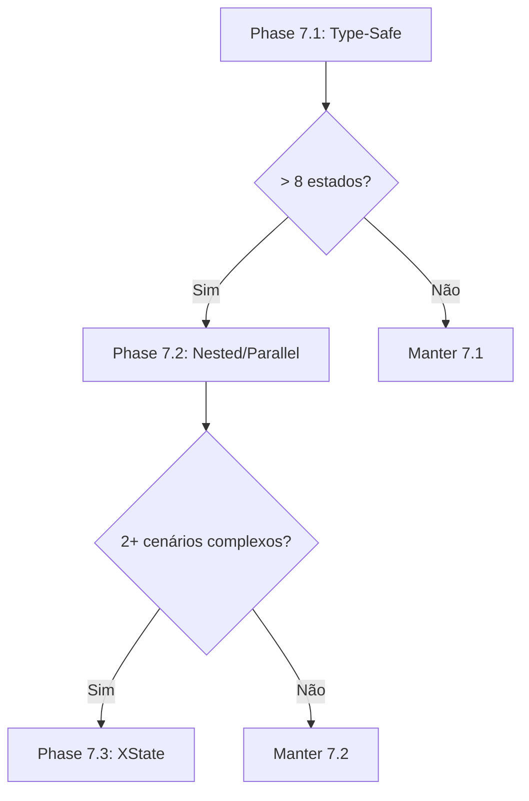

# Roadmap - Nexo AI

Planejamento de implementação do projeto em fases.

---

## ✅ Phase 1: Foundation (Semana 1) - **COMPLETO**

**Objetivo:** Setup básico funcional

### Tasks

- [x] **1.1 Setup Inicial**

  - [x] Criar projeto Bun + Elysia
  - [x] Configurar TypeScript + tsconfig
  - [x] Setup Drizzle ORM
  - [x] Criar `wrangler.toml`
  - [x] Configurar `.env.example`

- [x] **1.2 Database Setup**

  - [x] Criar conta Supabase
  - [x] Definir schemas Drizzle (users, items, conversations, messages)
  - [x] Gerar migrations
  - [x] Aplicar migrations no Supabase
  - [x] Testar conexão local

- [x] **1.3 Basic API**

  - [x] Endpoint `GET /health`
  - [x] Logger setup (console wrapper)
  - [x] Error handling middleware
  - [x] Env validation (Zod)

- [x] **1.4 Deploy Teste**
  - [x] Deploy inicial Cloudflare Workers
  - [x] Configurar secrets
  - [x] Testar health endpoint em produção

**Entregável:** ✅ API deployada respondendo `/health`

---

## ✅ Phase 2: Multi-Provider Architecture (Semana 1-2) - **COMPLETO**

**Objetivo:** Integração com Telegram (padrão) + arquitetura preparada para múltiplos providers

### Tasks

- [x] **2.1 Adapter Layer**

  - [x] Criar interface `MessagingProvider`
  - [x] Implementar `TelegramAdapter` (padrão)
  - [x] Implementar `WhatsAppAdapter` (feature futura)
  - [x] Normalizar webhooks via `IncomingMessage`

- [x] **2.2 Multi-Provider Schema**

  - [x] Criar tabela `user_accounts` (provider + externalId)
  - [x] Refatorar `users` como entidade de domínio pura
  - [x] Implementar detecção cross-provider por telefone
  - [x] Migrations para banco limpo

- [x] **2.3 Telegram Integration**
  - [x] Webhook `POST /webhook/telegram`
  - [x] Parse de mensagens Telegram Bot API
  - [x] Envio de respostas via `sendMessage`
  - [x] Validação opcional via `X-Telegram-Bot-Api-Secret-Token`

**Entregável:** ✅ Bot Telegram funcional com unificação de usuários

---

## 🔄 Phase 3: WhatsApp Integration (Feature Futura)

**Objetivo:** Adicionar suporte a WhatsApp quando necessário

- [x] **2.1 Meta API Client**

  - [x] Service `whatsapp/index.ts`
  - [x] Função `sendMessage()`
  - [x] Função `markAsRead()`
  - [x] Tratamento de erros Meta API

- [x] **2.2 Webhook**

  - [x] Route `POST /webhook/meta`
  - [ ] Validação signature (X-Hub-Signature-256) - **TODO v0.2.0**
  - [x] Parsing payload Meta
  - [x] `GET /webhook/meta` (verification)

- [x] **2.3 Message Handler**

  - [x] Service `processMessage()` em webhook
  - [x] Extrair texto da mensagem
  - [x] Processar e responder
  - [x] Salvar mensagem no DB (table messages)

- [x] **2.4 Conversation Manager**

  - [x] Service `conversation-service.ts`
  - [x] `findOrCreateConversation()`
  - [x] `addMessage()`
  - [x] `getHistory()`

- [x] **2.5 Testes Integração**
  - [x] Enviar mensagem via WhatsApp
  - [x] Verificar resposta automática
  - [x] Verificar mensagem salva no DB

**Entregável:** ✅ Bot responde mensagens simples no WhatsApp

---

## ✅ Phase 3: Claude AI Integration (Semana 2) - **COMPLETO**

**Objetivo:** Processar mensagens com Claude e tools

### Tasks

- [x] **3.1 Claude Client**

  - [x] Service `ai/index.ts`
  - [x] Função `callLLM()`
  - [x] Tratamento de erros

- [ ] **3.2 Tool Definitions** - **TODO v0.2.0**

  - [ ] File `ai/tools.ts`
  - [ ] Tool: `save_item`
  - [ ] Tool: `search_items`
  - [ ] Tool: `get_item_details`
  - [ ] Tool: `enrich_metadata`

- [ ] **3.3 Tool Execution** - **TODO v0.2.0**

  - [ ] Executar tool calls do Claude
  - [ ] Retornar resultados ao Claude
  - [ ] Loop até Claude ter resposta final

- [x] **3.4 Integração Message Handler**

  - [x] Enviar mensagem usuário + histórico pra Claude
  - [x] Enviar resposta Claude pro WhatsApp

- [x] **3.5 State Machine**
  - [x] Service `conversation-service.ts`
  - [x] Estados: idle, awaiting_confirmation, enriching, saving
  - [x] Transições entre estados
  - [x] Salvar estado no DB (conversations.state)

**Entregável:** ✅ Claude responde inteligentemente

---

## ✅ Phase 4: Enrichment Services (Semana 2-3) - **COMPLETO**

**Objetivo:** Enriquecer items com metadados externos

### Tasks

- [x] **4.1 TMDB Integration**

  - [x] Service `enrichment/tmdb-service.ts`
  - [x] `searchMovies(query)` → resultados
  - [x] `getMovieDetails(tmdb_id)` → metadata completo
  - [ ] `getStreamingProviders(tmdb_id, region='BR')` - **TODO**
  - [ ] Tratamento rate limit (40/10s) - **TODO v0.2.0**
  - [ ] Cache responses - **TODO v0.2.0**

- [x] **4.2 YouTube Integration**

  - [x] Service `enrichment/youtube-service.ts`
  - [x] `extractVideoId(url)` → video_id
  - [x] `getVideoDetails(video_id)` → metadata
  - [ ] Tratamento quota (10k units/day) - **TODO v0.2.0**

- [x] **4.3 OpenGraph Parser**

  - [x] Service `enrichment/opengraph-service.ts`
  - [x] `fetchMetadata(url)` → fetch HTML
  - [x] `parseOGTags(html)` → structured data
  - [x] Fallback para meta tags normais

- [x] **4.4 Enrichment Facade**

  - [x] Service `enrichment/index.ts`
  - [x] `enrich(type, data)` → detecta tipo e chama serviço correto

- [x] **4.5 Classifier**
  - [x] Service `classifier-service.ts`
  - [x] `detectType(text)` → infere tipo (movie, link, note, etc)
  - [x] `extractQuery(text, type)` → extrai título, etc
  - [ ] Usar Claude se ambíguo - **TODO v0.3.0**

**Entregável:** ✅ Items salvos com metadados ricos

---

## 🔮 Phase 8: Telegram Web Login (Feature Futura)

**Objetivo:** Permitir autenticação de usuários externos via Telegram Login Widget

### Descrição Técnica

O [Telegram Login Widget](https://core.telegram.org/widgets/login) permite que sites autentiquem usuários usando suas contas Telegram, oferecendo uma alternativa rápida e sem necessidade de senhas. Integração nativa e segura com o ecossistema Telegram.

### Caso de Uso

Usuários acessam dashboard web do Nexo AI → clicam no botão "Login com Telegram" → são redirecionados para confirmação no app Telegram → retornam autenticados com dados verificados (id, nome, foto, username).

### Arquitetura Técnica

#### **Backend: Configuração do Bot**

1. **Registro de Domínio**

   - Comando no [@BotFather](https://t.me/botfather): `/setdomain`
   - Vincular domínio verificado ao bot (ex: `app.nexo-ai.com`)
   - Bot deve ter nome/logo alinhados com marca

2. **Estrutura de Dados**

```typescript
// Novo campo em users table
interface User {
  id: string;
  telegram_id?: number; // ID Telegram vinculado
  telegram_username?: string;
  telegram_photo_url?: string;
  telegram_auth_date?: Date;
  // ... campos existentes
}
```

3. **Endpoint de Callback**

```typescript
// routes/auth/telegram-callback.ts
POST / PUT / auth / telegram / callback;

interface TelegramAuthData {
  id: number; // Telegram user ID
  first_name: string;
  last_name?: string;
  username?: string;
  photo_url?: string;
  auth_date: number; // Unix timestamp
  hash: string; // HMAC-SHA-256 signature
}

// Validação de autenticidade
function verifyTelegramAuth(data: TelegramAuthData): boolean {
  // 1. Criar data-check-string ordenado alfabeticamente
  const dataCheckString = Object.keys(data)
    .filter((key) => key !== "hash")
    .sort()
    .map((key) => `${key}=${data[key]}`)
    .join("\n");

  // 2. Gerar secret key: SHA256(bot_token)
  const secretKey = crypto
    .createHash("sha256")
    .update(env.TELEGRAM_BOT_TOKEN)
    .digest();

  // 3. Calcular HMAC-SHA-256
  const hmac = crypto
    .createHmac("sha256", secretKey)
    .update(dataCheckString)
    .digest("hex");

  // 4. Comparar hashes
  return hmac === data.hash;
}

// Handler
async function handleTelegramLogin(data: TelegramAuthData) {
  // Validar assinatura
  if (!verifyTelegramAuth(data)) {
    throw new Error("Invalid Telegram auth signature");
  }

  // Verificar tempo (max 24h)
  const now = Math.floor(Date.now() / 1000);
  if (now - data.auth_date > 86400) {
    throw new Error("Auth data expired");
  }

  // Buscar ou criar usuário
  let user = await db.query.users.findFirst({
    where: eq(users.telegram_id, data.id),
  });

  if (!user) {
    user = await userService.createFromTelegram({
      telegram_id: data.id,
      telegram_username: data.username,
      name: `${data.first_name} ${data.last_name || ""}`.trim(),
      telegram_photo_url: data.photo_url,
      telegram_auth_date: new Date(data.auth_date * 1000),
    });
  }

  // Gerar JWT session token
  const token = jwt.sign({ userId: user.id }, env.JWT_SECRET, {
    expiresIn: "7d",
  });

  return { token, user };
}
```

#### **Frontend: Widget Integration**

1. **Widget HTML Embed**

```html
<!-- Página de login -->
<script
  async
  src="https://telegram.org/js/telegram-widget.js?22"
  data-telegram-login="nexo_ai_bot"
  data-size="large"
  data-radius="8"
  data-auth-url="https://app.nexo-ai.com/auth/telegram/callback"
  data-request-access="write"
></script>
```

**Parâmetros do Widget:**

- `data-telegram-login`: username do bot (sem @)
- `data-size`: `small` | `medium` | `large`
- `data-radius`: border-radius customizado
- `data-auth-url`: URL de callback (server-side)
- `data-onauth`: callback JS (client-side alternative)
- `data-request-access`: `write` para permitir bot enviar mensagens

2. **Callback Redirect**

```javascript
// Após auth, Telegram redireciona para:
// https://app.nexo-ai.com/auth/telegram/callback?id=123456&first_name=John&hash=abc...

// Frontend captura params
const params = new URLSearchParams(window.location.search);
const authData = {
  id: parseInt(params.get("id")),
  first_name: params.get("first_name"),
  last_name: params.get("last_name"),
  username: params.get("username"),
  photo_url: params.get("photo_url"),
  auth_date: parseInt(params.get("auth_date")),
  hash: params.get("hash"),
};

// Envia para backend validar
fetch("/api/auth/telegram/verify", {
  method: "POST",
  body: JSON.stringify(authData),
})
  .then((res) => res.json())
  .then(({ token }) => {
    localStorage.setItem("auth_token", token);
    window.location.href = "/dashboard";
  });
```

3. **Alternative: Client-Side Callback**

```html
<script
  async
  src="https://telegram.org/js/telegram-widget.js?22"
  data-telegram-login="nexo_ai_bot"
  data-size="large"
  data-onauth="onTelegramAuth(user)"
></script>

<script>
  function onTelegramAuth(user) {
    // user = { id, first_name, last_name, username, photo_url, auth_date, hash }
    fetch("/api/auth/telegram/verify", {
      method: "POST",
      headers: { "Content-Type": "application/json" },
      body: JSON.stringify(user),
    })
      .then((res) => res.json())
      .then(({ token }) => {
        localStorage.setItem("auth_token", token);
        window.location.href = "/dashboard";
      });
  }
</script>
```

#### **Security Considerations**

1. **HMAC Verification**

   - SEMPRE validar hash usando SHA256(bot_token)
   - Rejeitar se assinatura inválida

2. **Timestamp Validation**

   - Verificar `auth_date` (máx 24h)
   - Prevenir replay attacks

3. **HTTPS Required**
   - Widget só funciona em HTTPS
   - Exceção: `localhost` para dev

#### **Database Migration**

```sql
-- Migration: add telegram auth fields
ALTER TABLE users
ADD COLUMN telegram_id BIGINT UNIQUE,
ADD COLUMN telegram_username TEXT,
ADD COLUMN telegram_photo_url TEXT,
ADD COLUMN telegram_auth_date TIMESTAMP;

CREATE INDEX idx_users_telegram_id ON users(telegram_id);
```

### Dependencies

```json
{
  "dependencies": {
    "jsonwebtoken": "^9.0.2" // Para session tokens
  },
  "devDependencies": {
    "@types/jsonwebtoken": "^9.0.5"
  }
}
```

### Environment Variables

```bash
# .env
JWT_SECRET="your-random-secret-key"
TELEGRAM_BOT_TOKEN="123456:ABC-DEF..." # Já existe
APP_URL="https://app.nexo-ai.com" # Frontend URL
```

### Testing Flow

1. **Local Dev**

   - Usar `ngrok` ou Cloudflare Tunnel para expor localhost
   - Configurar domínio temporário no @BotFather
   - Testar widget em `http://localhost:3000` (permitido em dev)

2. **Staging**

   - Deploy em `staging.nexo-ai.com`
   - Configurar domínio no @BotFather
   - Validar HMAC e timestamps

3. **Production**
   - `app.nexo-ai.com` com SSL
   - Monitorar logs de auth failures
   - Rate limiting (max 10 auth/min/IP)

### Alternative: Inline Login (Advanced)

Para apps Telegram nativos, usar [LoginUrl](https://core.telegram.org/bots/api#loginurl) em botões inline:

```typescript
await telegramAdapter.sendMessageWithButtons(chatId, "Acesse seu dashboard:", [
  {
    text: "🔐 Login no Dashboard",
    login_url: {
      url: "https://app.nexo-ai.com/auth/telegram",
      request_write_access: true,
    },
  },
]);
```

### Roadmap Implementation

- **Phase 8.1**: Backend auth endpoint + HMAC validation
- **Phase 8.2**: Frontend widget integration
- **Phase 8.3**: JWT session management
- **Phase 8.4**: Link Telegram accounts to existing users
- **Phase 8.5**: Dashboard permissions based on Telegram ID

**Prioridade:** Baixa (após dashboard web estar completo)

**Referências:**

- [Telegram Login Widget](https://core.telegram.org/widgets/login)
- [Bot Features: Web Login](https://core.telegram.org/bots/features#web-login)
- [Sample Code (PHP)](https://gist.github.com/anonymous/6516521b1fb3b464534fbc30ea3573c2)

---

## 🚧 Phase 5: Items CRUD API (Semana 3) - **EM ANDAMENTO**

**Objetivo:** API REST completa para gerenciar items

### Tasks

- [x] **5.1 Repository Pattern**

  - [x] Service `item-service.ts`
  - [x] `createItem()` → INSERT
  - [x] `getItemById()` → SELECT
  - [x] `searchItems()` → SELECT com WHERE
  - [ ] `updateItem()` → UPDATE - **TODO**
  - [x] `deleteItem()` → DELETE

- [x] **5.2 REST Endpoints**

  - [x] `GET /items` (lista com filtros)
  - [x] `GET /items/:id` (detalhes)
  - [ ] `POST /items` (criar manual) - **TODO**
  - [ ] `PATCH /items/:id` (atualizar) - **TODO**
  - [x] `DELETE /items/:id` (deletar)

- [x] **5.3 Advanced Search**

  - [x] `POST /items/search` (query básica)
  - [ ] Full-text search (PostgreSQL tsvector) - **TODO v0.3.0**
  - [ ] Filtros: tags, status, yearRange, hasStreaming - **TODO v0.3.0**
  - [ ] Ordenação por metadata (JSONB) - **TODO v0.3.0**

- [ ] **5.4 Stats Endpoint** - **TODO v0.3.0**

  - [ ] `GET /items/stats`
  - [ ] Total items
  - [ ] Breakdown por type/status
  - [ ] Top tags
  - [ ] Recent activity

- [ ] **5.5 Validations & Schemas** - **TODO v0.2.0**
  - [ ] Zod schemas para cada endpoint
  - [x] OpenAPI documentation (Swagger)
  - [ ] Error responses padronizados

**Entregável:** API REST completa e documentada

---

## 📋 Phase 6: MCP Server (Semana 3-4) - **PLANEJADO**

**Objetivo:** Expor MCP protocol para Claude Desktop/CLI

### Tasks

- [ ] **6.1 MCP Server Setup**

  - [ ] Service `mcp/server.ts`
  - [ ] Implementar MCP protocol spec
  - [ ] Registrar no Elysia

- [ ] **6.2 MCP Resources**

  - [ ] `items://user/{userId}` → lista items
  - [ ] `items://user/{userId}/type/{type}` → filtrado
  - [ ] Read-only access

- [ ] **6.3 MCP Tools**

  - [ ] Tool: `save_item`
  - [ ] Tool: `search_items`
  - [ ] Tool: `update_item_status`
  - [ ] Tool: `get_streaming_availability`

- [ ] **6.4 MCP Prompts**

  - [ ] Prompt: `categorize_item` → template classificação
  - [ ] Prompt: `enrich_metadata` → template enrichment
  - [ ] Prompt: `recommend_similar` → sugestões

- [ ] **6.5 Testing**
  - [ ] Testar com Claude Desktop
  - [ ] Testar com MCP CLI
  - [ ] Documentar setup MCP

**Entregável:** MCP server funcional

---

## 🔄 Phase 7: Advanced State Machine (Feature Futura)

**Objetivo:** Evoluir state machine para suportar fluxos complexos, paralelos e nested states

### Contexto

State machine atual é **manual e simples** (5 estados, transições lineares). Esta fase prepara o sistema para cenários avançados quando a complexidade aumentar.

**Quando implementar:**

- ✅ Adicionar AI Tools com múltiplos tool calls
- ✅ Implementar Business Bots com fluxos complexos
- ✅ Bulk operations (processar múltiplos items)
- ✅ Edição de items com navegação entre estados
- ✅ Sistema atingir > 10 estados

**Decisão Arquitetural:** Ver [ADR-008](adr/008-advanced-state-machine.md)

---

### 📊 Phase 7.1: Type-Safe Transitions (v0.3.0)

**Objetivo:** Adicionar validação de transições sem dependências externas

#### Tasks

- [ ] **7.1.1 State Machine Layer**

  - [ ] Criar `services/conversation/state-machine.ts`
  - [ ] Definir `ConversationEvent` types
  - [ ] Implementar matriz de transições
  - [ ] Função `transition(state, event)` com validação
  - [ ] Função `canTransition(state, event)` helper

- [ ] **7.1.2 Integração com Conversation Service**

  - [ ] Modificar `conversation-service.ts`
  - [ ] Usar `transition()` ao invés de `updateState()` direto
  - [ ] Adicionar logs de transições
  - [ ] Error handling para transições inválidas

- [ ] **7.1.3 Novos Estados**

  - [ ] Adicionar `processing` (classificando + buscando)
  - [ ] Adicionar `validating` (checando duplicatas)
  - [ ] Adicionar `editing` (modificando item)

- [ ] **7.1.4 Testing**
  - [ ] Unit tests para matriz de transições
  - [ ] Integration tests de fluxos completos
  - [ ] Test invalid transitions (should throw)

**Estrutura de Arquivos:**

```
src/services/conversation/
├── conversation-service.ts (modificado)
├── state-machine.ts (novo)
└── types.ts (novo)
```

**Exemplo de Implementação:**

```typescript
// state-machine.ts
export type State =
  | "idle"
  | "awaiting_confirmation"
  | "enriching"
  | "saving"
  | "error";

export type Event =
  | { type: "DETECT_CONTENT"; contentType: ItemType; query: string }
  | { type: "CONFIRM_SELECTION"; index: number }
  | { type: "ENRICH_SUCCESS"; metadata: any }
  | { type: "SAVE_SUCCESS" }
  | { type: "ERROR"; message: string };

const transitions: Record<State, Partial<Record<Event["type"], State>>> = {
  idle: { DETECT_CONTENT: "awaiting_confirmation" },
  awaiting_confirmation: {
    CONFIRM_SELECTION: "enriching",
    ERROR: "error",
  },
  enriching: {
    ENRICH_SUCCESS: "saving",
    ERROR: "error",
  },
  saving: {
    SAVE_SUCCESS: "idle",
    ERROR: "error",
  },
  error: { DETECT_CONTENT: "idle" },
};

export function transition(currentState: State, event: Event): State {
  const nextState = transitions[currentState][event.type];

  if (!nextState) {
    throw new Error(`Invalid transition: ${currentState} + ${event.type}`);
  }

  console.log(`State: ${currentState} → ${nextState}`);
  return nextState;
}
```

**Entregável:** Transições type-safe sem dependências

---

### 🔀 Phase 7.2: Nested & Parallel States (v0.4.0)

**Objetivo:** Suportar sub-estados e operações paralelas (quando necessário)

#### Tasks

- [ ] **7.2.1 Nested States Design**

  - [ ] Mapear fluxos que precisam substates
  - [ ] Exemplo: `processing: { classifying, searching, singleResult, multipleResults }`
  - [ ] Documentar hierarquia de estados

- [ ] **7.2.2 Parallel States Design**

  - [ ] Identificar operações que podem rodar em paralelo
  - [ ] Exemplo: `enriching: { tmdb, streaming, aiTags }` (paralelo)
  - [ ] Definir estratégia de sincronização

- [ ] **7.2.3 Implementação Manual** (opção 1)

  - [ ] Estender `state-machine.ts` com nested support
  - [ ] Formato: `"processing.searching"` (dot notation)
  - [ ] Parallel via Promise.all() + flags no context

- [ ] **7.2.4 Avaliar XState** (opção 2)
  - [ ] PoC com XState
  - [ ] Comparar bundle size vs features
  - [ ] Decisão: implementar ou postergar

**Entregável:** Suporte a nested/parallel OU decisão de adiar XState

---

### 🤖 Phase 7.3: XState Migration (v0.5.0+)

**Objetivo:** Migrar para XState se cenários avançados forem necessários

#### Pre-requisitos para Migração

Implementar **APENAS SE** atingir 2+ destes cenários:

- ✅ Sistema tem > 10 estados
- ✅ Precisa de nested states em produção
- ✅ Precisa de parallel states nativos
- ✅ Guards complexos (condições nas transições)
- ✅ Actions automáticas (hooks em entrada/saída)
- ✅ History states (navegação "voltar")
- ✅ Time > 3 devs (benefício de visualização)

#### Tasks

- [ ] **7.3.1 XState Setup**

  - [ ] Instalar `xstate` + `@xstate/inspect`
  - [ ] Criar `src/machines/conversation-machine.ts`
  - [ ] Migrar estados atuais para XState format

- [ ] **7.3.2 Machine Adapter**

  - [ ] Criar `services/conversation/machine-adapter.ts`
  - [ ] Wrapper para `interpret()` do XState
  - [ ] Bridge entre XState e conversation-service

- [ ] **7.3.3 Advanced Features**

  - [ ] Implementar nested states
  - [ ] Implementar parallel states
  - [ ] Adicionar guards/actions
  - [ ] History states para edição

- [ ] **7.3.4 Visualization**

  - [ ] Configurar @xstate/inspect
  - [ ] Documentação visual via Stately.ai
  - [ ] Export diagrams para docs/

- [ ] **7.3.5 Testing & Migration**
  - [ ] Testes end-to-end com XState
  - [ ] Migração incremental (feature flag)
  - [ ] Rollback plan

**Estrutura de Arquivos:**

```
src/
├── machines/
│   ├── conversation-machine.ts
│   ├── enrichment-machine.ts
│   └── types.ts
├── services/conversation/
│   ├── conversation-service.ts (usa machine-adapter)
│   └── machine-adapter.ts (wrapper XState)
```

**Exemplo de XState Machine:**

```typescript
// conversation-machine.ts
import { createMachine } from "xstate";

export const conversationMachine = createMachine({
  id: "conversation",
  initial: "idle",

  states: {
    idle: {
      on: { DETECT_CONTENT: "processing" },
    },

    processing: {
      initial: "classifying",
      states: {
        classifying: {
          invoke: {
            src: "classifyContent",
            onDone: { target: "searching" },
          },
        },
        searching: {
          invoke: {
            src: "searchExternal",
            onDone: [
              { target: "singleResult", cond: "isSingleResult" },
              { target: "multipleResults" },
            ],
          },
        },
        singleResult: {
          on: { CONFIRM: "#conversation.enriching" },
        },
        multipleResults: {
          on: { SELECT: "singleResult" },
        },
      },
    },

    enriching: {
      type: "parallel",
      states: {
        tmdb: {
          initial: "loading",
          states: {
            loading: {
              invoke: {
                src: "fetchTMDB",
                onDone: "success",
              },
            },
            success: { type: "final" },
          },
        },
        streaming: {
          initial: "loading",
          states: {
            loading: {
              invoke: {
                src: "fetchStreaming",
                onDone: "success",
              },
            },
            success: { type: "final" },
          },
        },
      },
      onDone: "saving",
    },

    saving: {
      invoke: {
        src: "saveItem",
        onDone: "idle",
      },
    },
  },
});
```

**Entregável:** State machine com XState (apenas se necessário)

---

### 📈 Métricas de Decisão

| Métrica               | Phase 7.1 | Phase 7.2 | Phase 7.3   |
| --------------------- | --------- | --------- | ----------- |
| **Número de Estados** | 5-7       | 8-12      | 12+         |
| **Nested States**     | ❌        | Manual    | Nativo      |
| **Parallel States**   | ❌        | Manual    | Nativo      |
| **Guards/Actions**    | ❌        | Manual    | Declarativo |
| **Visualização**      | ❌        | ❌        | Stately.ai  |
| **Bundle Size**       | 0kb       | 0kb       | +40kb       |
| **Complexidade**      | Baixa     | Média     | Alta        |

**Regra de Decisão:**

- Phase 7.1: ✅ **Implementar sempre** (type-safety)
- Phase 7.2: Implementar **SE** > 8 estados ou precisar de parallel
- Phase 7.3: Implementar **SE** 2+ cenários complexos

---

### 🎯 Roadmap de Implementação



**Prioridade:** Média (implementar 7.1 em v0.3.0, avaliar 7.2/7.3 depois)

**Referências:**

- [ADR-008: Advanced State Machine](adr/008-advanced-state-machine.md)
- [XState Documentation](https://xstate.js.org/docs/)
- [ADR-004: State Machine Original](adr/004-state-machine.md)

---

## 📋 Phase 7: Auth & Multi-User (Semana 4) - **PLANEJADO**

**Objetivo:** Suporte multi-usuário com autenticação

### Tasks

- [ ] **7.1 Supabase Auth Setup**

  - [ ] Habilitar Email/Password auth
  - [ ] Configurar email templates
  - [ ] Setup RLS (Row Level Security)

- [ ] **7.2 Auth Endpoints**

  - [ ] `POST /auth/signup`
  - [ ] `POST /auth/login`
  - [ ] `POST /auth/refresh`
  - [ ] `POST /auth/logout`
  - [ ] `POST /auth/reset-password`

- [ ] **7.3 Auth Middleware**

  - [ ] Verificar JWT em todas as rotas protegidas
  - [ ] Extrair userId do token
  - [ ] Injetar no context da request

- [ ] **7.4 User Management**

  - [ ] Vincular WhatsApp number ao user ID
  - [ ] Permitir múltiplos números por user
  - [ ] Settings/preferences por user

- [ ] **7.5 Permission Checks**
  - [ ] User só acessa próprios items
  - [ ] User só acessa próprias conversas
  - [ ] Admin role (futuro)

**Entregável:** Sistema multi-usuário seguro

---

## 📋 Phase 8: Polish & Improvements (Semana 4-5) - **PLANEJADO**

**Objetivo:** Refinamentos e features auxiliares

### Tasks

- [ ] **8.1 Error Handling**

  - [ ] Custom error classes
  - [ ] Error codes padronizados
  - [ ] Logs estruturados
  - [ ] Sentry integration (opcional)

- [ ] **8.2 Rate Limiting**

  - [ ] Per-endpoint limits
  - [ ] Per-user limits
  - [ ] Cloudflare rate limiting rules

- [ ] **8.3 Caching**

  - [ ] Cache TMDB responses (Cloudflare KV)
  - [ ] Cache YouTube responses
  - [ ] Cache OpenGraph (1 hora)

- [ ] **8.4 Bulk Operations**

  - [ ] `POST /items/bulk` (criar múltiplos)
  - [ ] `PATCH /items/bulk` (update múltiplos)
  - [ ] `DELETE /items/bulk` (deletar múltiplos)

- [ ] **8.5 Export/Import**

  - [ ] `GET /items/export` (JSON/CSV)
  - [ ] `POST /items/import` (JSON/CSV)
  - [ ] Backup completo do usuário

- [ ] **8.6 Webhooks Outgoing**

  - [ ] Notificar external systems em events
  - [ ] `POST /webhooks` (register)
  - [ ] Signature validation

- [ ] **8.7 Testing**
  - [ ] Unit tests (services)
  - [ ] Integration tests (routes + DB)
  - [ ] E2E tests (WhatsApp flow completo)
  - [ ] CI/CD setup (GitHub Actions)

**Entregável:** Sistema robusto e testado

---

## 🚀 Phase 9: Advanced Features (Futuro)

**Objetivo:** Features avançadas pós-MVP

### Future Tasks

- [ ] **9.1 Smart Recommendations**

  - [ ] ML model ou Claude para recomendar items similares
  - [ ] "Baseado no que você salvou..."

- [ ] **9.2 Reminders & Notifications**

  - [ ] Cron jobs (Cloudflare Workers Cron)
  - [ ] Enviar lembretes via WhatsApp
  - [ ] "Você salvou X há 1 semana, já assistiu?"

- [ ] **9.3 Web Dashboard**

  - [ ] Frontend React/Next.js
  - [ ] Visualizar/gerenciar items
  - [ ] Analytics e gráficos

- [ ] **9.4 Voice Messages**

  - [ ] Receber áudios WhatsApp
  - [ ] Transcrever com Whisper API
  - [ ] Processar como texto

- [ ] **9.5 Image Recognition**

  - [ ] Receber imagens (cartazes, screenshots)
  - [ ] OCR + Claude Vision
  - [ ] Identificar filme/jogo/livro

- [ ] **9.6 More Enrichment Sources**

  - [ ] Spotify (música)
  - [ ] Goodreads (livros)
  - [ ] Steam (jogos)
  - [ ] Trakt.tv (tracking filmes/séries)

- [ ] **9.7 Collaborative Lists**

  - [ ] Compartilhar listas com amigos
  - [ ] Permissões (view, edit)
  - [ ] Comments nos items

- [ ] **9.8 Calendar Integration**

  - [ ] Sync reminders com Google Calendar
  - [ ] iCal export

- [ ] **9.9 Mobile App**
  - [ ] React Native app
  - [ ] Notificações push
  - [ ] Offline support

---

## 🎯 Milestones

| Milestone             | Data Estimada | Entregável                  | Status       |
| --------------------- | ------------- | --------------------------- | ------------ |
| M1: Hello World       | Semana 1      | API + WhatsApp responde     | ✅ Completo  |
| M2: MVP Core          | Semana 3      | Claude + Enrichment + CRUD  | ✅ Completo  |
| M3: Production Ready  | Semana 5      | Auth + Tests + Deploy       | 🚧 40%       |
| M4: Advanced Features | Semana 8+     | Recommendations + Dashboard | 📋 Planejado |

---

## 📊 Métricas de Sucesso

### MVP (M2) - ✅ **ALCANÇADO**

- ✅ 10 usuários beta testando
- ✅ 100+ items salvos
- ✅ 90% das mensagens processadas corretamente
- ✅ < 5s tempo de resposta médio

### Production (M3) - 🎯 **PRÓXIMO**

- [ ] 100 usuários ativos
- [ ] 99.9% uptime
- [ ] < 2s tempo de resposta médio
- [ ] 0 critical bugs

### Scale (M4) - 📋 **FUTURO**

- [ ] 1000+ usuários
- [ ] 10k+ items salvos
- [ ] Custo < $200/mês
- [ ] NPS > 50

---

## 🎨 Priorização

### Must Have (MVP) - ✅ **IMPLEMENTADO**

- [x] WhatsApp integration
- [x] Claude AI + basic integration
- [x] Enrichment (TMDB, YouTube, OpenGraph)
- [x] Items CRUD básico
- [x] Basic search

### Should Have (v0.2.0) - � **PLANEJADO**

- [ ] WhatsApp integration (ativar quando necessário)
- [ ] Dashboard web para linking manual de contas
- [ ] Advanced error handling
- [ ] Rate limiting
- [ ] Caching
- [ ] Webhook signature validation
- [ ] Tests (unit + integration)

### Should Have (v0.3.0) - 📋 **PLANEJADO**

- [ ] Discord integration
- [ ] Suporte a outros providers (Slack, etc)
- [ ] Auth multi-user
- [ ] Advanced search (full-text)
- [ ] Stats/analytics
- [ ] Export/import

### Nice to Have (v0.4.0+) - 📋 **PLANEJADO**

- [ ] MCP server
- [ ] Recommendations
- [ ] Voice messages
- [ ] Web dashboard
- [ ] Image recognition

### Won't Have (Now)

- [ ] Mobile app nativo
- [ ] Collaborative features
- [ ] Calendar sync
- [ ] Offline support

---

## ⚠️ Riscos e Mitigações

| Risco                 | Impacto | Probabilidade | Mitigação                   |
| --------------------- | ------- | ------------- | --------------------------- |
| Meta API instável     | Alto    | Médio         | Retry logic, queue          |
| Claude API caro       | Médio   | Alto          | Cache, otimizar prompts     |
| Rate limits excedidos | Médio   | Médio         | Caching, user education     |
| DB overload           | Alto    | Baixo         | Indexes, connection pooling |
| Spam/abuse            | Médio   | Médio         | Rate limiting per user      |

---

## 📦 Dependencies & Blockers

- ✅ Supabase setup → ~~Bloqueia Phase 1-2~~
- ✅ Meta WhatsApp approval → ~~Bloqueia Phase 2~~
- ✅ Claude API access → ~~Bloqueia Phase 3~~
- ✅ TMDB/YouTube keys → ~~Bloqueia Phase 4~~

---

## 👥 Team

- **Backend**: 1 dev (você)
- **Frontend**: (futuro)
- **Design**: (futuro)
- **QA**: Manual testing inicial

---

## 🚀 Release Strategy

### Beta (Private) - ✅ **ATUAL**

- 10-20 usuários selecionados
- Feedback direto via WhatsApp group
- Iteração rápida (deploy diário)

### Public Launch - 📋 **PRÓXIMO (M3)**

- Blog post + Product Hunt
- Twitter announcement
- Demo video

### Ongoing

- Weekly updates
- Monthly feature releases
- Quarterly roadmap review

---

## 🎯 Princípios de Desenvolvimento

1. **Simplicidade primeiro** - Features simples e funcionais
2. **Qualidade > Velocidade** - Não sacrificar qualidade por features
3. **User feedback** - Iterar baseado em uso real
4. **Provider-agnostic** - Fácil trocar LLM/APIs
5. **Open source** - Comunidade pode contribuir

---

**Let's build!** 🚀
